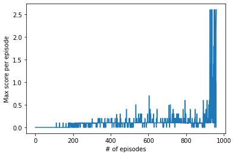
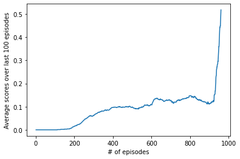

# Report

## Abstract

We report on the project for the collaboration and competition solved using the Multi Agent Deep Deterministic Policy Gradient (MADDPG) to train multiple agents.

#### *Prerequisites*

For prerequisites, it may be helpful to refer to [DDPG paper](https://arxiv.org/abs/1509.02971) as well as [MADDPG paper](https://arxiv.org/abs/1706.02275).

## Set-up

Suppose that there are two agents who play tennis separated by the net. Each of them gains a **reward** of **+0.1** if hits the ball over the net. On the other hand, a negative **reward** of **-0.1** is given to an agent if it lets a ball hit fall onto the ground or hits the ball out of bounds.

The **observation** space is parametrized by **8** variables corresponding to position and velocity of the ball and racket Every **action** forms a vector with **2** continuous components, corresponding to movement toward (or away from) the net, and jumpint. Each entry in the action vector is valued in **[-1, 1]** by clipping.

## Goal

Our goal for this **episodic** task is that the agents try to maximize their scores as much as possible by keeping the ball in play. To solve the environment, the agents must get an average score of **+0.5** over 100 consecutive episodes. Such an average scores is computed as follows:

- After each episode, we find the scores (= the sum of rewards) gained by each agent (without discounting), so that we find a score for each agent: 2 (potentially) different scores.
- Then by comparing these two scores, the larger one (=maximum value) is adopted. This is used for computing an average score over last 100 episodes. The latter score should be compared with the threshold, namely, +0.5.

## Learning Algorithm

Here we give a brief summary of essential constituents in our algorithm. Then we present the structure of our neural networks.

### - MADDPG

Multi Agent Deep Deterministic Policy Gradient (MADDPG) is a upgraded algorithm of the **Deep Deterministic Policy Gradient** (DDPG) in the presence of multiple agents. The DDPG is a combination of the off-policy Actor-Critic method and the Deep-Q-Learning (DQN). A single DDPG agent plays two different roles: the **actor** model selects an action recommended as per some policy and the **critic** model estimates the expected rewards in the future and then evaluates the policy. So in modeling DDPG agents, both the actor and the critic are played by two distinguished neural networks.

The MADDPG agent integrate multiple DDPG agents. However, within the MADDPG algorithm, DDPG agents collaborate together to achieve a goal whilst they compete with each other towards a higher score. To this end, they indeed recognize the actions and states (,or behaviors) of all the other agents in the sense that the Q-value is evaluated by each critic with different weights by using the action-state pairs of **all the agents**. As such, the resulting MADDPG model thereby realize a more interacting system that solves a more complex task.

Fore more details, see [MADDPG paper](https://arxiv.org/abs/1706.02275).

#### **Remarks**
For optimization, when updating the critic model, we evaluate the mean-squared-error (mse) of the Q-values from both the regular and target networks at a time step $t$. For a $j$-th DDPG agent, when the episode continues to the next time step $t+1$, its target critic returns
$$
r^{(j)}_{t} + \gamma \ast Q^{(j)}(s^{(1)}_{t+1}, a^{(1)}_{t+1}, s^{(2)}_{t+1}, a^{(2)}_{t+1}),\qquad j=1,2,
$$
where $r^{(j)}_{t}$ is a reward, $\gamma$ is a discount factor, and the action is given via $a^{i}_{t+1} = \pi^{(i)}(s^{i}_{t+1})$. Also, all the weights involved in $\pi^{(i)}$ and $Q^{(j)}$ are from each target network. If the episode ends at $t$, the second term is truncated.
Moreover, the weights of the actors are updated in such a way that the actor selects a suitable action to make the mean of Q-values from the local critic **bigger** (Be careful with an extra minus sign! in the actor's loss!).

Note that like in the DDPG, we use in the DDPG the **replay buffer**. Also, we have both local(or regular), and target networks for the actor and critic models, respectively. The local networks are used for the training while the target networks for the prediction to stabilize the training. The weights of the target networks are optimized using the so-called **soft update** strategy. The latter get the trained weights of the local networks slowly copied to the those of the target ones. In general this update method yields a faster convergence.

Moreover, we blended states with some noises using the Ornstein-Uhlenbeck process for efficiency of learning (See [`here`](https://en.wikipedia.org/wiki/Ornstein%E2%80%93Uhlenbeck_process), for instance. Conventions for the parameters are given.). Also, in the training process of the critic model, the gradient clipping was used, so that the gradient was truncated up to 1.

### - Structure of neural networks

Here let us focus on DDPG agents. Their actor and critic models are a combination of fully connected layers as well as ReLu activation functions. First, the actor model has two dense layers between which ReLu function is inserted. Then the output is passed through the tanh activation. On the other hand, the critic model first takes in both states and actions of **all the DDPG agents**, followed by two series of the dense layer and the ReLu activation. The first dense layer has 256 nodes whereas the second has 128 nodes. Then we concatenate the output with the actions chosen by the actor. Then the last fully-connected layer returns the Q-value.

#### Remarks

In the notebook `model.py`, we prepared layers for the Batch normalization but did not use them, because the results became worse.

### - Hyperparameters

Finally, we collected the following set of hyperparameters for our model below. Note that the random seeds are not given here.

```
- BUFFER_SIZE = 100000 # the size of the replay buffer
- BATCH_SIZE = 256 # batch size
- GAMMA = 0.999 # discount factor
- hidden units for actors = 128 # number of nodes in the linear layers in the actor models for each agent.
- hidden units for critic = [256, 128] # number of nodes in the first and second linear layers in the critic models for each agent

# For learning process
- LEARN_EVERY = 1 # time steps per which the learning occurs
- LR_ACTOR = 0.0001 # learning rate for actor model
- LR_CRITIC = 0.001 # learning rate for critic model
- WEIGHT_DECAY_ACTOR = 0.0 # weight decay for the actor
- WEIGHT_DECAY_CRITIC = 0.0 # weight decay for the critic
- COUNT_LEARNING = 1 # frequency per which the updates occur per learning
- TAU =  0.1 # parameter for soft update

# For O-U process
- EPSILON = 1.0 # initial noise factor
- EPSILON_DECAY = 0.999 # noise decay rate
- EPSILON_MIN = 0.3 # lower bound for epsilon
- mu = 0.0
- theta = 0.15
- sigma = 0.1

# For implementation
- the preset number of episodes = 5000
- threshold = 0.5 # required scores to solve the environment
```

This time around, we assigned the same learning rates to the actor and critic networks and got a successful result. This makes a difference from the case for a taks involving a single DDPG agent. In the latter case, it is likely that using different learnng rates is essential for the successful training.

## Results

Using the networks and hyperparameters in the previous section, we present the results of the performance of our MADDPG model including 2 agents equipped with the DDPG model. The environment was solved within 5000 episodes and indeed only in 961 episodes.

The maximum scores between two agents per episode in the whole history are given in the following figure. It turned out that the maximum scores per episode greatly increased from around 900 episodes and satisfied the requirement to solve the environment within less than around 1000 episodes.



Moreover, the improvement of the cummulative average scores in the deque list (size: 100) is shown below.



We see that after 800 episodes, the average score slightly decreased but greatly improved after around 900 epsodes. Consequently the learning process worked well. The weights of the trained actor and critic models are saved as `check_point_agentl_actor.pth`, `check_point_agentl_critic.pth`, `check_point_agentr_actor.pth`, and `check_point_agentr_critic.pth`.

## Conclusions

In this project of the collaboration and competition, we constructed a model that involves the MADDPG method using two DDPG agents. As such, the environment was solved after 961 episodes.

Let us make a few comments on open questions. In our MADDPG algorithm, two DDPG agents interact with each other in the sense of Q-values evaluated by each critic model. It might be worth comparing our results with those obtained from the model comprising non-interacting DDPG agents and understanding the extent of correlations between two DDPG agents.

Regarding the hyper parameters, we first point out that we got a better result by choosing different random seeds. This implies that it might be interesting to understand to what extent the choice of such random values and possibly the initialization of weights affect the final reults. 

Moreover, instead of the replay buffer with the random sampling, using [Prioritized Experience Replay (PER)](https://github.com/rlcode/per) might be helpful to boost the learning.

We might come back to these issues elsewhere.